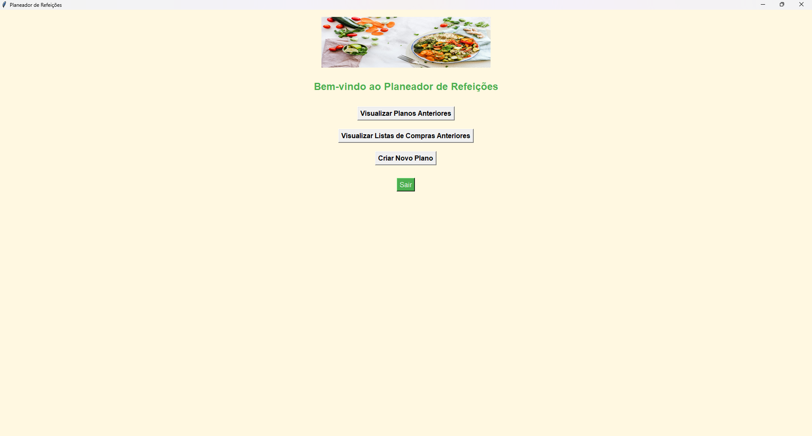
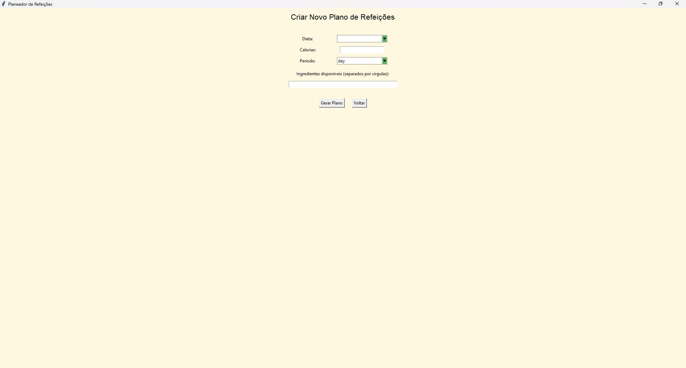
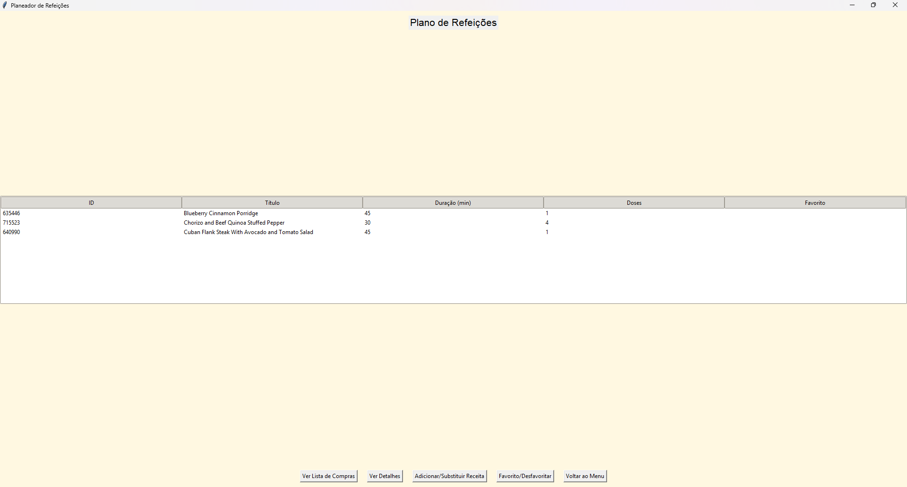
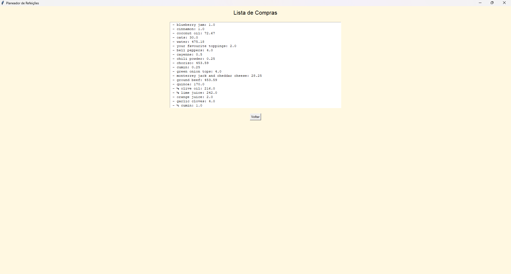
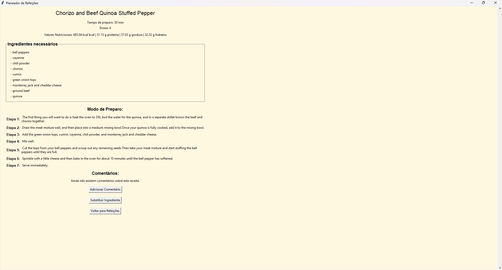

# Plano de Refeições 🍽️


Um aplicativo Python para **planeamento de refeições diárias e semanais**, integração com a **API Spoonacular**, sugestões de receitas, informações nutricionais detalhadas e lista de compras automática.

---

## Funcionalidades

- Gerar planos de refeições diárias ou semanais com base nas preferências do usuário.
- Pesquisar receitas por ingredientes disponíveis.
- Obter detalhes de receitas, incluindo modo de preparo e informações nutricionais.
- Gerar lista de compras com os ingredientes necessários.
- Sugerir substituições de ingredientes.
- Totalmente personalizável com dieta, calorias alvo e restrições alimentares.

### Exemplos visuais

#### Página Inicial


#### Menu Criar Plano


#### Plano de Refeições


#### Lista de Compras


#### Detalhes da Receita


---

## Tecnologias Utilizadas

- Python 3.10+
- Requests
- API Spoonacular
- dotenv (para variáveis de ambiente)


---

## Instalação

1. **Clone o repositório**

```bash
git clone https://github.com/Franciscoq54/plano-de-refeicoes.git
cd plano-de-refeicoes 
```

2. **Crie e ative um ambiente virtual**
```bash
python -m venv env
# Windows
env\Scripts\activate
# macOS/Linux
source env/bin/activate
```

3. **Instale as dependências**
```bash
pip install -r requirements.txt
```

4. **Configure a chave da API Spoonacular**
```bash
#Crie um arquivo .env na raiz do projeto:
SPOONACULAR_API_KEY=sua_chave_aqui
#Certifique-se de que o .env está no .gitignore.
```

## Uso

```python
#Exemplo rápido em Python:
from api import planoRefeicoes, obterReceitas
import os
from dotenv import load_dotenv

load_dotenv()
api_key = os.getenv("SPOONACULAR_API_KEY")

# Gerar plano de refeição diário
plano = planoRefeicoes(api_key, time_frame='day', target_calories=2000, dieta='vegetarian')
print(plano)

# Pesquisar receitas com ingredientes disponíveis
receitas = obterReceitas(['tomate', 'queijo'], api_key, numero_receitas=3)
for r in receitas:
    print(r['title'])
```

## Estrutura do Projeto

plano-de-refeicoes/
│
├─ api/                # Chamadas à API Spoonacular
├─ config/             # Configurações (ex.: config.example.json)
├─ data/               # Dados de exemplo
├─ interface/          # CLI ou GUI
├─ utils/              # Funções auxiliares
├─ assets/             # GIFs e screenshots para README
├─ main.py             # Arquivo principal
├─ requirements.txt
├─ .env                # Variáveis de ambiente (não subir no GitHub)
└─ README.md

## Licença
MIT License © [Franciscoq54]


---

💡 **O que fazer agora:**

1. Crie uma pasta `assets/` na raiz do projeto.  
2. Adicione seus **GIFs e screenshots** com os nomes indicados (`demo.gif`, `plano_refeicoes.png`, etc.).  
3. Faça commit do README atualizado:

```bash
git add README.md assets/
git commit -m "Atualiza README com visual e exemplos"
git push origin main
